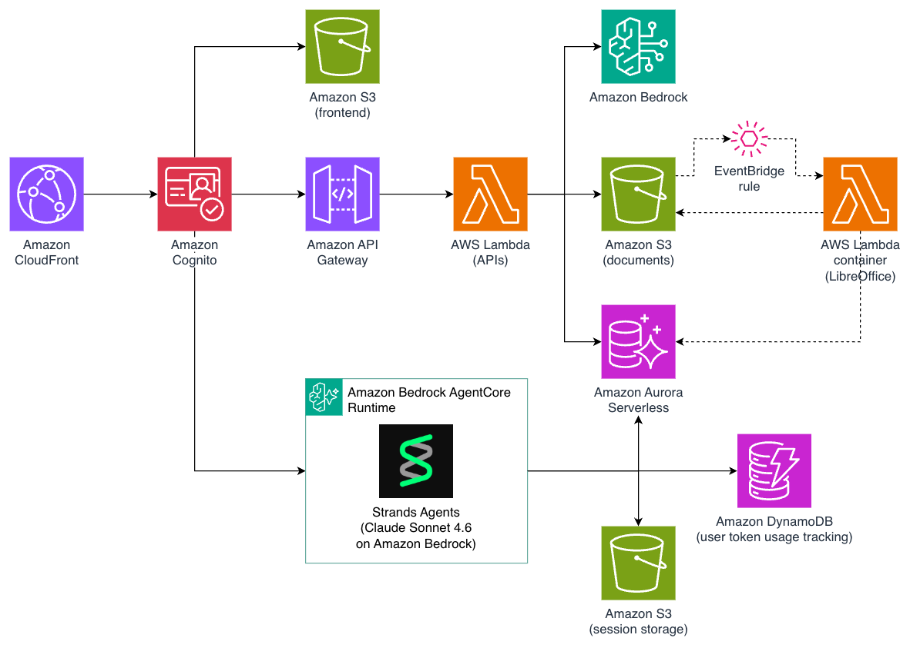

# Louis — Architecture



---

## Overview

Louis is a serverless AI document workspace on AWS. Users upload documents, chat with an AI agent (Louis), run tabular data extractions, and manage workflows — all backed by AWS-native services. No servers, no containers at runtime.

**Key technologies:** React 19 · AWS Amplify Auth v6 · Amazon API Gateway · AWS Lambda (ARM64) · Amazon Aurora Serverless v2 · Amazon Bedrock AgentCore Runtime · Amazon Bedrock · Amazon S3 · Amazon CloudFront

---

## Repo Structure

```
mike-on-aws/
├── frontend/           React 19 + Vite SPA
├── infra/
│   ├── lib/            CDK stack definitions (5 stacks)
│   ├── lambda/
│   │   ├── api/        Express backend (routes, middleware, lib)
│   │   ├── conversion/ LibreOffice DOCX→PDF converter
│   │   └── post-confirmation/  Cognito trigger → user_profiles insert
│   └── migrations/     Single idempotent schema file
├── agents/app/
│   ├── main/           louisMain agent (Strands SDK)
│   └── tabular/        louisTabular agent (tabular review chat)
└── scripts/            deploy-agent.sh, deploy-frontend.sh, init-db.sh
```

---

## Infrastructure (CDK Stacks)

All stacks in `infra/`, region `eu-west-1`. Deploy order matters; cross-stack values flow via CDK exports.

| Stack | Provisions | Key outputs |
|---|---|---|
| `StorageStack` | S3: docs bucket (EventBridge enabled, CORS), sessions bucket, skills bucket, frontend bucket, agent deploy bucket; CloudFront + OAC; SPA 404→200 fallback | `DocsBucketName`, `SessionsBucketName`, `SkillsBucketName`, `AgentDeployBucketName`, `DistributionDomainName` |
| `DatabaseStack` | Aurora Serverless v2 PostgreSQL 16.3 — 0–1 ACU, auto-pause, RDS Data API, VPC isolated subnets | `ClusterArn`, `SecretArn` |
| `AuthStack` | Cognito User Pool (SRP, email verification, no MFA); Post-Confirmation Lambda; Identity Pool (per-user S3 prefix IAM) | `UserPoolId`, `UserPoolClientId`, `IdentityPoolId` |
| `AgentStack` | S3 admin config bucket (private); seeds `mcp.json` and `browse-allowlist.json` | `AdminBucketName` |
| `ApiStack` | API Gateway (Cognito authorizer); API Lambda (ARM64, 1024 MB, 29 s); DynamoDB credits table; Amazon Bedrock AgentCore Runtime execution IAM role | `ApiUrl`, `AgentCoreExecutionRoleArn` |
| `ConversionStack` | Conversion Lambda (x86_64, 2048 MB, 5 min); EventBridge rule on `documents/*.docx`, `.doc`, `.pdf` | `ConversionLambdaArn` |

Agents deployed via `scripts/deploy-agent.sh <agentName>` — builds ZIP, uploads to agent deploy bucket, calls Amazon Bedrock AgentCore Runtime `create/update-agent-runtime`. Runtime IDs/ARNs stored in SSM at `/louis/agents/<agentName>/runtimeId`.

---

## Authentication

Single token: **Cognito id_token**. Frontend fetches via `fetchAuthSession()` (Amplify Auth v6), passed as `Authorization: Bearer <id_token>` everywhere.

| Consumer | How it validates | What it gets |
|---|---|---|
| API Gateway | Native Cognito User Pool authorizer (JWKS validation, 300s cache) | `claims.sub` → `userId`, `claims.email` — injected into Express `res.locals` |
| Amazon Bedrock AgentCore Runtime | JWT inbound authorizer (Cognito OIDC discovery) before `/invocations` | Agent decodes `sub` from header for SQL ownership guards |
| S3 uploads | Presigned `PutObject` URL (15 min TTL) signed by API Lambda role | Client PUTs directly to S3 — no AWS credentials on frontend |

**Post-confirmation trigger:** On email verification, Lambda inserts a `user_profiles` row (user_id = sub, default tier/settings).

---

## API Routes

Base URL: `https://{api-gateway-domain}`. All routes require `Authorization: Bearer <id_token>` except `GET /health`.

### Chat

| Method | Path | Description |
|---|---|---|
| GET | `/chat` | List user's chats |
| POST | `/chat/create` | Create chat session |
| GET | `/chat/:chatId` | Fetch chat metadata |
| GET | `/chat/:chatId/messages` | Read conversation history from S3 snapshots |
| PUT | `/chat/:chatId/session-id` | Persist AgentCore session ID (idempotent, first turn) |
| GET | `/chat/:chatId/session-id` | Fetch persisted AgentCore session ID |
| PATCH | `/chat/:chatId` | Rename chat |
| DELETE | `/chat/:chatId` | Delete chat + best-effort S3 cleanup |
| POST | `/chat/:chatId/generate-title` | Auto-generate title via Bedrock |

### Documents

| Method | Path | Description |
|---|---|---|
| POST | `/single-documents/prepare` | Generate presigned S3 PutObject URL |
| POST | `/single-documents/:id/register` | Insert document_versions V1 row, set status='ready' |
| GET | `/single-documents` | List user's documents |
| GET | `/single-documents/:id/display` | Fetch document metadata |
| GET | `/single-documents/:id/url` | Presigned GET URL for DOCX/PDF |
| GET | `/single-documents/:id/docx` | Presigned URL for DOCX download |
| GET | `/single-documents/:id/versions` | List document versions |
| POST | `/single-documents/:id/annotations` | Upload/update annotations |
| PATCH | `/single-documents/:id` | Update document metadata |
| GET | `/single-documents/:id/edits` | Fetch tracked-change edits |
| POST | `/single-documents/:id/edits/:editId/accept` | Accept edit |
| POST | `/single-documents/:id/edits/:editId/reject` | Reject edit |
| POST | `/single-documents/download-zip` | Batch download as ZIP |
| DELETE | `/single-documents/:id` | Hard delete document |

### Projects

| Method | Path | Description |
|---|---|---|
| GET | `/projects` | List user's projects |
| POST | `/projects` | Create project |
| GET | `/projects/:id` | Fetch project details |
| PATCH | `/projects/:id` | Update project (name, visibility, sharing) |
| DELETE | `/projects/:id` | Delete project + cascade |
| GET | `/projects/:id/people` | List collaborators |
| PATCH | `/projects/:id/share` | Update sharing settings |
| GET | `/projects/:id/documents` | List project documents |
| POST | `/projects/:id/documents/prepare` | Prepare presigned upload URL |
| POST | `/projects/:id/documents/:docId/register` | Register document in project |
| GET | `/projects/:id/chats` | List project chats |
| POST | `/projects/:id/folders` | Create folder |
| PATCH | `/projects/:id/folders/:folderId` | Rename folder |
| DELETE | `/projects/:id/folders/:folderId` | Delete folder |

### Tabular Review

| Method | Path | Description |
|---|---|---|
| GET | `/tabular-review` | List user's tabular reviews |
| POST | `/tabular-review` | Create tabular review |
| POST | `/tabular-review/prompt` | Generate extraction prompt |
| GET | `/tabular-review/:id` | Fetch review details |
| GET | `/tabular-review/:id/people` | List collaborators |
| PATCH | `/tabular-review/:id` | Update review config |
| DELETE | `/tabular-review/:id` | Delete review + cascade |
| POST | `/tabular-review/:id/clear-cells` | Reset all extracted cells |
| POST | `/tabular-review/:id/generate` | Trigger cell extraction via agent |
| GET | `/tabular-review/:id/chats` | List tabular chats |
| POST | `/tabular-review/:id/chats` | Create tabular chat |
| POST | `/tabular-review/:id/chats/:chatId/messages` | Persist messages + assistant turn |
| GET | `/tabular-review/:id/chats/:chatId/messages` | Fetch tabular chat history |

### Workflows

| Method | Path | Description |
|---|---|---|
| GET | `/workflows` | List workflows (user's + system) |
| POST | `/workflows` | Create workflow |
| GET | `/workflows/:id` | Fetch workflow |
| PUT | `/workflows/:id` | Replace workflow definition |
| PATCH | `/workflows/:id` | Partial update |
| DELETE | `/workflows/:id` | Delete workflow |
| GET | `/workflows/hidden` | List hidden workflows |
| POST | `/workflows/hidden` | Hide workflow |
| DELETE | `/workflows/hidden/:id` | Unhide workflow |
| GET | `/workflows/:id/shares` | List shares |
| POST | `/workflows/:id/share` | Share with user(s) |
| DELETE | `/workflows/:id/shares/:shareId` | Revoke share |

### User

| Method | Path | Description |
|---|---|---|
| GET | `/user/profile` | Fetch current user profile |
| PUT | `/user/profile` | Update profile (display_name, organisation, tabular_model, disabled_mcp_servers) |
| POST | `/user/profile` | Create profile (migration fallback) |
| GET | `/user/mcp-servers` | List MCP servers configured in admin bucket |
| DELETE | `/user/account` | Hard delete account + all data |

### Misc

| Method | Path | Description |
|---|---|---|
| GET | `/health` | Liveness probe (no auth) |
| GET | `/download` | List downloads |
| GET | `/download/presigned` | Presigned GET URL for download |

---

## Agent Architecture

Two agents run as Amazon Bedrock AgentCore Runtimes:

- **`louisMain`** — main document chat agent
- **`louisTabular`** — tabular review chat agent

Each implements a raw Express HTTP server with `GET /ping` and `POST /invocations` (SSE). OTEL auto-instrumentation injected at startup.

### louisMain Tools

| Tool | Purpose |
|---|---|
| `read_document` | Fetch document content from S3 |
| `find_in_document` | Semantic search within a document |
| `list_documents` | List documents in scope (user or project) |
| `fetch_documents` | Batch-fetch multiple documents |
| `generate_docx` | Create a new DOCX from agent content |
| `edit_document` | Apply tracked-change edits to existing DOCX |
| `replicate_document` | Copy a document within a project |
| `read_table_cells` | Read tabular review cell data |
| `list_workflows` | List workflows (user's + system) |
| `read_workflow` | Fetch a workflow definition |
| `browse_web` | Fetch a page from an admin-allowlisted domain (`browse-allowlist.json`) |
| `read_local_file` | Read a skill file from `/tmp` (Skills feature) |
| MCP tools | Dynamic — loaded from enabled MCP servers at cold start |

**Skills:** On session start, the agent downloads user-uploaded Skill folders from S3 to `/tmp/<userId>/skills/`. Each skill has a `SKILL.md` manifest; the agent discovers and reads skill files on demand via `read_local_file`.

**MCP servers:** Admin uploads `mcp.json` to the admin S3 bucket (Claude Code format). Agent loads and caches MCP server configs at cold start, wires `McpClient[]` filtered by the user's `disabled_mcp_servers` preference. Only StreamableHTTP transport supported. Optional per-server `authSecretName` resolves a Bearer token from Secrets Manager (`louis/mcp/*` prefix).

### louisTabular Tools

| Tool | Purpose |
|---|---|
| `read_table_cells` | Read extracted cells for a review |

System prompt built per-request with review title, column manifest, and document list. S3-backed session persistence — same pattern as louisMain (`conversations/{chatId}/messages.json`).

### Credits Metering

Strands `AfterModelCallEvent` hook increments `credits_used` in DynamoDB (`PK=userId`, `SK=YYYY-MM`, atomic ADD) after each model call. Tracking is live; enforcement gate (429 + `CreditsExhaustedModal`) not yet implemented — see Known Gaps.

### SSE Event Protocol

| `type` | Emitted when | UI effect |
|---|---|---|
| `content_delta` | Text token from Bedrock | Streamed text |
| `tool_call_start` | Before any tool | "Working…" badge |
| `doc_read_start` / `doc_read` | read_document before/after | Reading spinner |
| `doc_find_start` / `doc_find` | find_in_document before/after | Searching spinner |
| `doc_created_start` / `doc_created` | generate_docx before/after | Download card |
| `doc_edited_start` / `doc_edited` | edit_document before/after | Tracked-change card |
| `doc_replicate_start` / `doc_replicated` | replicate_document before/after | Copy summary card |
| `content_done` | Turn complete | Citation loading |
| `citations` | Citation extraction done | Inline superscripts |
| `error` | Unhandled exception | Error in bubble |
| `[DONE]` | Stream closed | Stream reader exits |

---

## Chat Session Flow

**New chat:** `POST /chat/create` → Aurora row → frontend generates `runtimeSessionId` (UUID) → posts to AgentCore URL with `{ prompt, chatId, runtimeSessionId, model }` → streams SSE → on `[DONE]`, agent persists `agentcore_session_id` → `POST /:chatId/generate-title`.

**Subsequent turns:** Same `runtimeSessionId` sent each turn — AgentCore restores accumulated context from session layer.

**Page reload:** `GET /chat/:chatId/session-id` fetches `agentcore_session_id` → turn continuity restored.

---

## Document Upload Flow

```
1. Browser → POST /single-documents/prepare
   API Lambda inserts documents row (status='processing'), returns presigned PutObject URL (15 min TTL)

2. Browser → S3 PutObject via presigned URL (no AWS creds on client)

3. Browser → POST /single-documents/:id/register
   API Lambda inserts document_versions V1 row, sets status='ready'

4. S3 PutObject → EventBridge → Conversion Lambda
   - DOCX/DOC: LibreOffice headless → PDF → upload to converted-pdfs/ prefix
   - PDF: copy to converted-pdfs/ prefix
   - Updates document_versions.pdf_storage_path in Aurora
```

---

## Storage

### Amazon S3

Six buckets, all `blockPublicAccess: BLOCK_ALL`:

| Bucket | Access | Purpose |
|---|---|---|
| **Docs** | API Lambda (presigned URLs); Identity Pool (per-user prefix, read only) | User document uploads, converted PDFs, agent-generated DOCX |
| **Sessions** | API Lambda + AgentCore only | AgentCore conversation snapshots (JSON); lazy-loaded per chat on demand |
| **Skills** | API Lambda (presigned upload URLs); AgentCore read | User-uploaded Skill folders downloaded to `/tmp` at session start |
| **Admin** | API Lambda (read); AgentCore (read); AWS admin (write directly) | `mcp.json`, `browse-allowlist.json` — admin-managed config, no app writes |
| **Frontend** | CloudFront OAC only (SigV4) | React SPA static assets |
| **Agent Deploy** | API Lambda (upload); AgentCore Runtime | Agent ZIP packages (`louisMain/`, `louisTabular/` prefixes) |

**Docs bucket key layout:**
```
documents/<user-pool-sub>/<document-id>/<filename>.<ext>   ← original upload
documents/<user-pool-sub>/<document-id>/<filename>.pdf     ← Conversion Lambda output
generated/<user-pool-sub>/<document-id>/<filename>.docx    ← generate_docx tool output
```

---

### Amazon DynamoDB

Single table: `CreditsTable` (pay-per-request)
- PK: `userId` (Cognito sub) · SK: `month` (YYYY-MM)
- `credits_used` — atomically incremented after each Bedrock model call via Strands `AfterModelCallEvent` hook

---

### Amazon Aurora (Relational Database)

Aurora Serverless v2 PostgreSQL 16.3, accessed via RDS Data API only (no VPC egress from Lambda). Queries via `query` / `queryOne` / `execute` helpers wrapping `RDSDataClient`.

Schema: `infra/migrations/000_one_shot_schema.sql` — single idempotent file, safe to re-run.

#### Tables

**`user_profiles`** — one row per Cognito user (created by Post-Confirmation Lambda)
- `user_id` (text, unique) — Cognito sub
- `email`, `display_name`, `organisation`, `tier`, `tabular_model`
- `disabled_mcp_servers` (jsonb, default `[]`) — array of MCP server IDs the user has toggled off

**`projects`**
- `user_id` — owner
- `name`, `cm_number`, `visibility` (`private`/`shared`)
- `shared_with` (jsonb array of `{ userId, email, role }`) — GIN indexed

**`project_subfolders`** — self-referential (`parent_folder_id`) for nested folders within a project

**`documents`**
- `project_id` (nullable — standalone docs have no project)
- `user_id`, `filename`, `file_type`, `size_bytes`, `page_count`, `status`
- `folder_id` → `project_subfolders`
- `current_version_id` → `document_versions` (pointer to active version)
- `structure_tree` (jsonb) — never written; retained for future use

**`document_versions`** — version history per document
- `storage_path` (S3 key for DOCX/original), `pdf_storage_path` (S3 key for converted PDF)
- `source` enum: `upload | user_upload | assistant_edit | user_accept | user_reject | generated`
- `version_number`, `display_name`

**`document_edits`** — tracked changes from agent edits; one row per change
- `document_id`, `version_id`
- `change_id`, `del_w_id`, `ins_w_id` — Word revision IDs
- `deleted_text`, `inserted_text`, `context_before`, `context_after`
- `status` enum: `pending | accepted | rejected`

**`workflows`**
- `user_id` (nullable for system workflows), `is_system` (bool)
- `title`, `type`, `prompt_md`, `columns_config` (jsonb), `practice`

**`hidden_workflows`** — user preference; unique on `(user_id, workflow_id)`

**`workflow_shares`** — `(workflow_id, shared_with_email)` unique; `allow_edit` bool

**`chats`**
- `project_id` (nullable — standalone chats), `user_id`, `title`
- `agentcore_session_id` — persisted after first turn for session continuity

**`tabular_reviews`**
- `project_id` (nullable), `user_id`, `title`
- `columns_config` (jsonb), `workflow_id`, `practice`
- `shared_with` (jsonb array) — GIN indexed

**`tabular_cells`** — one row per `(review_id, document_id, column_index)`; unique constraint enforced
- `content` (text), `citations` (jsonb), `status`

**`tabular_review_chats`** — chats scoped to a tabular review

---

## Models

All LLM calls via Bedrock Converse API, eu-west-1 cross-region inference profiles. Model selectable per conversation. See [AWS Bedrock model cards](https://docs.aws.amazon.com/bedrock/latest/userguide/model-cards.html) for current IDs.

| Label | Bedrock model ID |
|---|---|
| Claude Opus 4.7 | `eu.anthropic.claude-opus-4-7` |
| Claude Sonnet 4.6 (default) | `eu.anthropic.claude-sonnet-4-6` |
| Claude Haiku 4.5 | `eu.anthropic.claude-haiku-4-5-20251001-v1:0` |

---

## Well-Architected Considerations

**Security**
- API Gateway and AgentCore Runtime both protected by JWT auth via Cognito User Pool.
- IAM roles scoped per service; no shared execution roles across Lambda functions.
- All S3 buckets private; CloudFront OAC for frontend; short-lived presigned URLs for document uploads.
- Secrets in Secrets Manager; Aurora in VPC isolated subnets, RDS Data API only.

**Reliability**
- Fully stateless Lambda functions — auto-scaling, no single point of failure.
- Aurora Serverless v2 with multi-AZ failover. S3-backed session snapshots survive agent restarts.

**Performance Efficiency**
- Fully serverless — no capacity planning, no idle compute. Lambda, Aurora Serverless v2, and DynamoDB all scale on demand and to zero.

**Operational Excellence**
- Full CDK IaC — all infrastructure version-controlled, modular stacks, no click-ops.
- Lambda Powertools on all functions: structured JSON logging, X-Ray tracing, custom metrics.
- Single idempotent migration file; automated deploy scripts for frontend and agents.

**Cost Optimization**
- Serverless-first: pay-per-invocation Lambda, pay-per-ACU Aurora (scales to zero), pay-per-request DynamoDB.
- No provisioned concurrency — trade cold-start latency for zero idle cost.

**Known Gaps**
- Security hardening not production-grade: no WAF, rate limiting, Bedrock Guardrails, or CloudTrail/GuardDuty.
- Credit tracking live but enforcement gate (429) not yet implemented.
- Cold start latency on Lambda + Aurora (no provisioned concurrency, Aurora min ACU = 0) - may need to refresh browser a few times after inactivity.
- Route files use `console.log` — Lambda Powertools logger not yet injected into routes.
- Project sharing / member management UI incomplete.
- Edit card status (accepted/rejected) not re-hydrated on chat history load — tracked changes in reloaded conversations always show as pending regardless of current DB state. Fix tracked in Issue 26.
